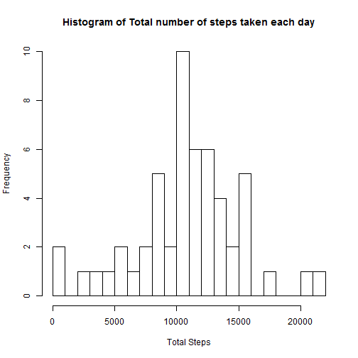
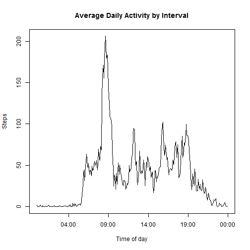
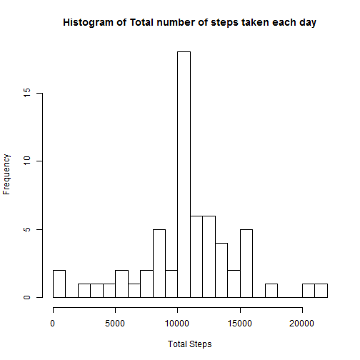
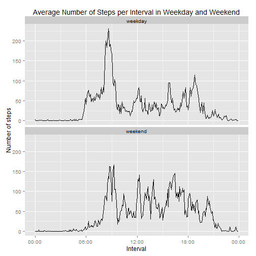

The assignment will address different questions based on data about personal movement collected using activity monitoring devices.

## Loading and preprocessing the data

Activity monitoring devices collect data at 5 minute intervals through out the day. The data consists of two months of data from an anonymous individual collected during the months of October and November, 2012 and include the number of steps taken in 5 minute intervals each day (Roger D. Peng)

Dataset is avalable from [Activity monitoring data](https://d396qusza40orc.cloudfront.net/repdata%2Fdata%2Factivity.zip) [52K]. The datafile must be first downloaded into the working directory and then unziped.

Loading libraries needed for further data computation and plotting:


```r
library(dplyr)
library(ggplot2)
library(scales)
```

Make sure the data file *activity.csv* is in the working directory. In case the file is not there the sript should stop with an error message


```r
datafile <- "activity.csv"
if (!file.exists(datafile)) {
    stop("Data file activity.csv is not in the working directory")
}
```

Read raw data into a dataframe using *read.csv()* function


```r
data <- read.csv(datafile, sep=",", colClasses=c("numeric", "Date", "numeric"), header=TRUE, stringsAsFactors=FALSE)
head(data)
```

```
##   steps       date interval
## 1    NA 2012-10-01        0
## 2    NA 2012-10-01        5
## 3    NA 2012-10-01       10
## 4    NA 2012-10-01       15
## 5    NA 2012-10-01       20
## 6    NA 2012-10-01       25
```

```r
summary(data)
```

```
##      steps             date               interval     
##  Min.   :  0.00   Min.   :2012-10-01   Min.   :   0.0  
##  1st Qu.:  0.00   1st Qu.:2012-10-16   1st Qu.: 588.8  
##  Median :  0.00   Median :2012-10-31   Median :1177.5  
##  Mean   : 37.38   Mean   :2012-10-31   Mean   :1177.5  
##  3rd Qu.: 12.00   3rd Qu.:2012-11-15   3rd Qu.:1766.2  
##  Max.   :806.00   Max.   :2012-11-30   Max.   :2355.0  
##  NA's   :2304
```

The *interval* column consists of numeric values representing 5-minute interval in which measurement was taken. Values rank from 0 (time of 00:00) to 2355 (23:55) with gap of 5 except when hour changed (with gap of 45, for example 1155 to 1200). In the next code the column's values are converted to fixed-length character format *"HHMM"* for further converting to datetime.


```r
data$interval <- sprintf("%04d",data$interval)
```


## What is mean total number of steps taken per day?

For this part the assignment asked to ignore missing value.

#### 1. Calculate the total number of steps taken per day

The *summarise()* function of package *dplyr* was used to canculate total number of steps taken each day. *Date* column was converted to factor for grouping operation.


```r
dsum <- summarise(group_by(na.omit(data), date=as.factor(date)), total=sum(steps))
tail(dsum)
```

```
## Source: local data frame [6 x 2]
## 
##         date total
## 1 2012-11-24 14478
## 2 2012-11-25 11834
## 3 2012-11-26 11162
## 4 2012-11-27 13646
## 5 2012-11-28 10183
## 6 2012-11-29  7047
```


#### 2. Make a histogram of the total number of steps taken each day

Function *hist()* of *base* plotting package is used to make a histogram of the total number of steps taken each day.


```r
hist(dsum$total, breaks = 20, main = "Histogram of Total number of steps taken each day", xlab="Total Steps")
```

 

The histogram shows that days with total number of steps 10000 to 11000 are observed most frequently (10 days). At the same time there is no date with total number of steps from 1000 to 2000, 16000 to 17000 or 18000 to 20000 steps.

#### 3. Calculate and report the mean and median of the total number of steps taken per day


```r
summarise(dsum, Mean=mean(total), Median=median(total))
```

```
## Source: local data frame [1 x 2]
## 
##       Mean Median
## 1 10766.19  10765
```


## What is the average daily activity pattern?

In this part it is required to calculate average number of steps taken in each 5-minutes interval, accross all days. The *summarise()* function is used with the data grouped by interval and NA values removed.


```r
iavg <- summarise(group_by(data,interval), average=mean(steps,na.rm=TRUE))
```


#### 1. Make a time series plot of average number of steps by intervals

*interval* data is converted to datetime class POSIXlt with date portion is the current date. Since all x-axis values will have the same date then plotting function shows only time portions of data with 5 minutes gaps, which is acceptable as a time serie. If *interval* was not converted to datetime then numeric values with inequal gaps will shown in x-axis and thus the plot will be distorted. 


```r
with(iavg, plot(strptime(interval,"%H%M"), average, type="l", xlab="Time of day", 
                ylab="Steps", main="Average Daily Activity by Interval"))
```

 

The highest average number of steps is observed after 8 A.M. with other active periods around 1 P.M. and 5 P.M. The next session shows the interval with maximum value.

#### 2. The interval, on average across all the days in the dataset, contains the maximum number of steps?


```r
iavg[(iavg$average==max(iavg$average)),"interval"]
```

```
## Source: local data frame [1 x 1]
## 
##   interval
## 1     0835
```


## Imputing missing values

#### 1. Calculate and report the total number of missing values in the dataset


```r
nrow(data[is.na(data$steps),])
```

```
## [1] 2304
```

```r
unique(data[is.na(data$steps), "date"])
```

```
## [1] "2012-10-01" "2012-10-08" "2012-11-01" "2012-11-04" "2012-11-09"
## [6] "2012-11-10" "2012-11-14" "2012-11-30"
```

#### 2. Devise a strategy for filling in all of the missing values in the dataset

To fill in missing values of an interval the average number of steps accross all days (calculated in previous session) for the same inteval will be used. The average number of steps for a given day is not well suited for imputing missing values because some date has NA for all of its intervals.

#### 3. Create a new dataset that is equal to the original dataset but with the missing data filled in
Simple *for* loop is used to fill in missing values with interval's average number of steps (accross all days)


```r
data1 <- data
for (i in 1:nrow(data1)) {
    if (is.na(data1[i,]$steps)) {
        data1[i,]$steps <- as.numeric(iavg[(iavg$interval == data1[i,]$interval),"average"])
    }
}
```

#### 4. Make a histogram of the total number of steps taken each day

Total number of steps taken each day of new dataset with missing data filled in


```r
dsum1 <- summarise(group_by(data1,date=as.factor(date)), total=sum(steps))
head(dsum1)
```

```
## Source: local data frame [6 x 2]
## 
##         date    total
## 1 2012-10-01 10766.19
## 2 2012-10-02   126.00
## 3 2012-10-03 11352.00
## 4 2012-10-04 12116.00
## 5 2012-10-05 13294.00
## 6 2012-10-06 15420.00
```

Histogram of total number of steps taken each day:


```r
hist(dsum1$total, breaks = 20, main = "Histogram of Total number of steps taken each day", xlab="Total Steps")
```

 

The mean and median total number of steps taken per day based on new dataset:


```r
summarise(dsum1, Mean=mean(total), Median=median(total))
```

```
## Source: local data frame [1 x 2]
## 
##       Mean   Median
## 1 10766.19 10766.19
```

By employing above-mentioned imputing missing value strategy the mean total number of steps taken per day did not changed. It is because for each interval with missing data the average accross all days for the given interval was used to fill in the data. So total number of steps taken for the day with missing data for all intervals after imputing data will be equal to total of all interval averages, or equal to the mean total number of steps taken per day accross all days.  

As per result shown in point 1, there are 8 days with missing data of all time intervals. After imputing data the total number of steps taken in each of these days will be the mean value of total number of steps taken each day accross all days (see above). Since before imputing the mean and median (middle number) are very close (10766.19 and 10765), so after imputing these 8 days will have values in the middle of the rank, and the median and mean for the dataset will be the same 10766.19

The total daily number of steps will be increased since NA were replace by values.


## Are there differences in activity patterns between weekdays and weekends?

#### 1. Create a new factor variable in the dataset with two levels - "weekday" and "weekend"

Use *ifelse()* to divide *date* into 2 factors:


```r
data1 <- mutate(data1, day=as.factor(ifelse(weekdays(data1$date) %in% c("Saturday","Sunday"), "weekend", "weekday")))
```

#### 2. Make a panel plot containing a time series plot.

Created new dataset which averages number of steps first by day of the week factor (weekday, weekend) and then by time interval.


```r
iavg1 <- summarise(group_by(data1, day, interval), average=mean(steps))
```

Plot using *ggplot2* the panel plot containing a time series plot of the 5-minute interval and the average number of steps taken, averaged across all weekday days or weekend days


```r
g <- ggplot(iavg1, aes(strptime(interval,"%H%M"), average)) + 
    geom_line() + facet_wrap(~ day, ncol = 1) + 
    xlab("Interval") +
    ylab("Number of steps") +
    scale_x_datetime(labels = date_format("%R")) + 
    ggtitle("Average Number of Steps per Interval in Weekday and Weekend")
print(g)
```

 

For the weekday and weekend the activity patterns are similar with maximum in the morning after 8 A.M. probably related to exercise. For the rest of the day from 9 A.M. to 9 P.M. the parterns look the same but weekend has higher absolute value, probably in weekday the object spends time in the office which is less active. From 9 P.M. to 6 A.M. in both weekday and weekend a pattern representing a rest time is observed.
